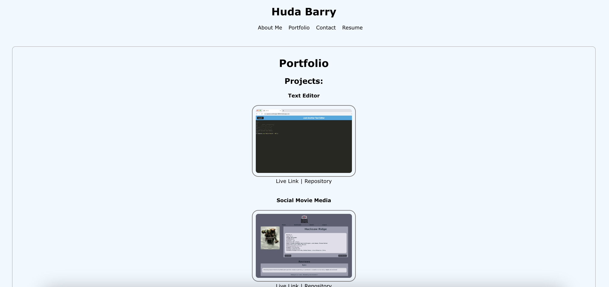
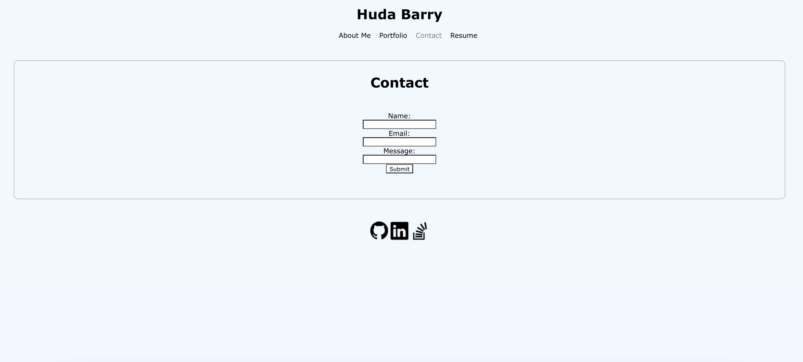

# React-Portfolio

## Description

- This is a personal portfolio created by using react.

## Usage

- [Click here](https://hbarry89.github.io/React-Portfolio/) to navigate to the live link of this repository.

---------------------------

- Screenshots:

---------------------------

---------------------------

---------------------------

## Credit

### Resources :books:
- Bootcamp Materials
- Unit 20: Activity 24
- Demonstration by TA in class
- Tutor

### Assets :sparkles:

- For a list of all [npm](https://www.npmjs.com/) packages used in this application, please refer to the *package.json* file.
- Logo made by [SVG Logo Maker](https://github.com/hbarry89/SVG-Logo-Maker)
- Icons from [Icon Finder](https://www.iconfinder.com/)

### Applications Used :gear:
- VS Code

Thank you for visiting! :ribbon:

